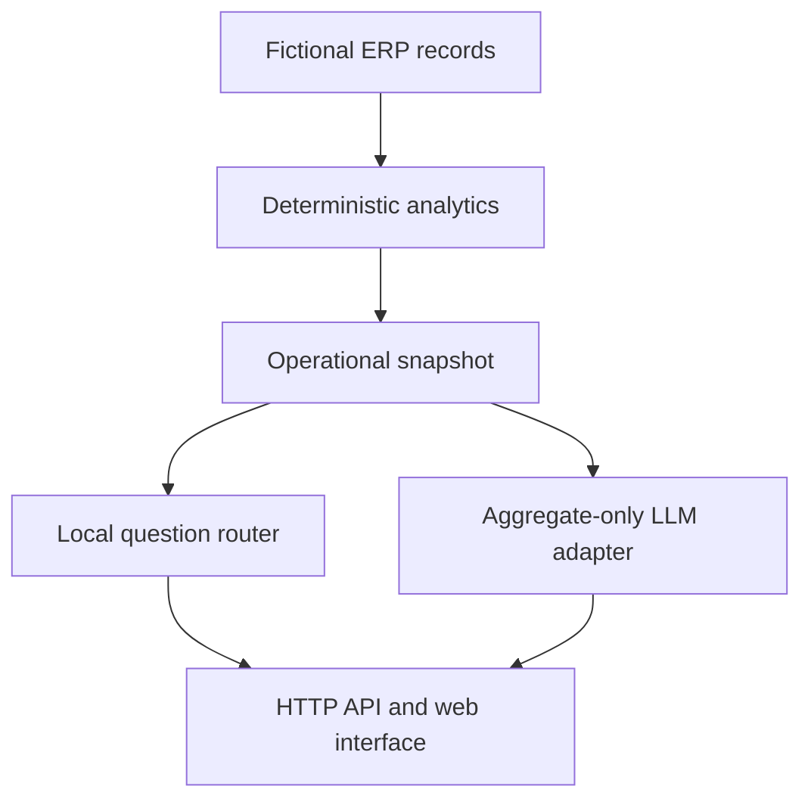

# AI ERP Assistant

[](https://github.com/Sembla/ai-erp-assistant/actions/workflows/tests.yml)

An executable portfolio prototype for querying fictional ERP-like operational data in Brazilian Portuguese. It combines deterministic analytics, a local question router, a dependency-free Node.js API and an optional LLM explanation mode.

> All orders, customers, inventory items and production records are synthetic. The application is not connected to a real ERP and cannot execute operational actions.

## Problem

Operational teams frequently need quick answers about late orders, inventory shortages, production risk and customer volume. A useful assistant should continue working without an external model and should not send raw ERP rows to an LLM by default.

## What is implemented

- Operational snapshot calculated from fictional orders, inventory and production jobs.
- Deterministic answers for delays, inventory, production, customers and order value.
- Native Node.js HTTP API with request-size limits and explicit error responses.
- Responsive browser interface served by the same application.
- Optional OpenAI Responses API mode with automatic local fallback.
- Aggregate-only context boundary for the external model.
- Automated analytics, assistant and HTTP integration tests.
- GitHub Actions workflow with manual execution support.

## Architecture



| Component | Responsibility |
|---|---|
| `src/data/demoData.ts` | Fictional orders, inventory and production records |
| `src/services/analytics.ts` | Delay, inventory, production and customer calculations |
| `src/services/assistant.ts` | Accent-insensitive deterministic question routing |
| `src/services/llm.ts` | Optional Responses API adapter using aggregate context only |
| `src/server.ts` | HTTP routes, validation, fallback and static-file delivery |
| `public/` | Responsive no-build browser interface |
| `tests/` | Unit and HTTP integration tests |

## Run locally

Requirements: Node.js 24 or newer. The local mode has no third-party runtime dependencies.

```bash
git clone https://github.com/Sembla/ai-erp-assistant.git
cd ai-erp-assistant
npm start
```

Open `http://127.0.0.1:3001`.

Example questions:

- `Quais pedidos estão atrasados?`
- `Como está o estoque?`
- `Existe risco na produção?`
- `Qual cliente tem maior volume?`
- `Faça um resumo operacional.`

## API

| Method | Route | Purpose |
|---|---|---|
| `GET` | `/health` | Service and demo-data status |
| `GET` | `/api/summary` | Complete deterministic operational snapshot |
| `POST` | `/api/ask` | Local or optional LLM answer |

Example:

```bash
curl -X POST http://127.0.0.1:3001/api/ask \
  -H "Content-Type: application/json" \
  -d '{"question":"Quais pedidos estão atrasados?","mode":"local"}'
```

## Optional LLM mode

Copy `.env.example` values into your environment and configure both variables:

```bash
export OPENAI_API_KEY="your-key"
export OPENAI_MODEL="gpt-5.6"
```

The browser never receives the API key. The server sends only calculated metrics, top-customer summaries and low-stock summaries—not complete order rows. If configuration or the request fails, the endpoint returns the deterministic local answer with a visible warning.

## Run validation

```bash
npm run check
npm test
```

The test suite covers calculations, ordering, invalid dates, the aggregate-only LLM boundary, accent-insensitive intent classification, question limits, API routes and LLM fallback.

## Intentional scope

This is a small executable prototype, not an enterprise ERP platform. It deliberately does not claim:

- Connection to a production ERP or database.
- Authentication, multi-tenancy or role-based access control.
- Real-time events, write operations or autonomous actions.
- Forecasting, optimization or audited financial outputs.
- Production readiness or compliance certification.

## Next steps

- Add a versioned database adapter contract.
- Add authentication and role-based authorization.
- Add immutable audit logs without storing prompts containing sensitive data.
- Add evaluation fixtures for LLM faithfulness and refusal behavior.
- Deploy a read-only demonstration with synthetic data.

## Author

Henrique Sembla — [GitHub](https://github.com/Sembla) · [LinkedIn](https://www.linkedin.com/in/henriquessembla)
